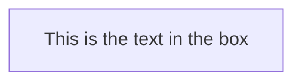
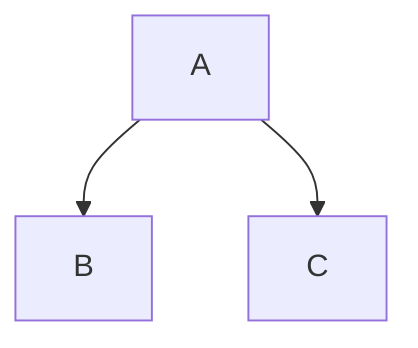

# Mermaid 🧜‍♀️
On Feb 14, 2022, Mermaid finally made its way to Github MD 👏
- [ ] [About Mermaid](http://mermaid-js.github.io/mermaid/#/) the repo
- [x] [Generator](https://mermaid-js.github.io/mermaid-live-editor/edit#pako:eNpNj7EKgzAQhl8l3NSCDu3oUKhG6FawbsYhmLMGTCIxoS3quzdWhN50_N93cP8EjREICTwtHzpSUqZJmGt141bUJI4vc4lvN5P0UBivxXHj6UpINlFs5CiNXrY4-x3cNc6EVgWOvnfkVP-z8mVmku_sXEMECq3iUoQfptVk4DpUyCAJq8CWB5EB00tQ_SC4w1xIZywkLe9HjIB7Zx4f3UDirMddopKHSmoLly9A_0pT) 

## 01_Flowchart [Basic Syntax](https://mermaid-js.github.io/mermaid/#/./flowchart?id=flowcharts-basic-syntax)
All Flowcharts are composed of 
1. Nodes
2. The geometric shapes
3. Edges: the arrows or lines

**A node:** The id is what is displayed in the box.

**A graph:** This statement declares the direction of the Flowchart.
- This declares the flowchart is oriented from top to bottom (TD or TB)

