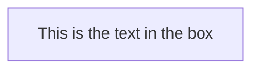
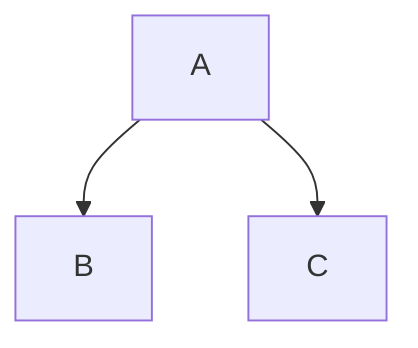
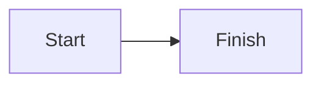

# Mermaid 🧜‍♀️
On Feb 14, 2022, Mermaid finally made its way to Github MD 👏
- [About Mermaid](http://mermaid-js.github.io/mermaid/#/) the repo
    - [x] Basic Flowchart
    - [ ] [Subgraph](https://mermaid-js.github.io/mermaid/#/./flowchart?id=subgraphs)
- [x] [Generator](https://mermaid-js.github.io/mermaid-live-editor/edit#pako:eNpNj7EKgzAQhl8l3NSCDu3oUKhG6FawbsYhmLMGTCIxoS3quzdWhN50_N93cP8EjREICTwtHzpSUqZJmGt141bUJI4vc4lvN5P0UBivxXHj6UpINlFs5CiNXrY4-x3cNc6EVgWOvnfkVP-z8mVmku_sXEMECq3iUoQfptVk4DpUyCAJq8CWB5EB00tQ_SC4w1xIZywkLe9HjIB7Zx4f3UDirMddopKHSmoLly9A_0pT) 

## 01_Flowchart [[syntax]](https://mermaid-js.github.io/mermaid/#/./flowchart?id=flowcharts-basic-syntax)
All Flowcharts are composed of 
1. Nodes
2. The geometric shapes
3. Edges: the arrows or lines

**A node:** The id is what is displayed in the box.
```
graph LR;
    id1[This is the text in the box]
```



**A graph:** This statement declares the direction of the Flowchart.
- TD: This declares the flowchart is oriented from top to bottom (TD or TB)
- LR: This declares the flowchart is oriented from left to right

```
graph TD;
    A-->B;
    A-->C;
```



```
flowchart LR;
    Start-->Finish;
```



### More
- Nodes shapes [[here]](https://mermaid-js.github.io/mermaid/#/./flowchart?id=node-shapes)
- Link betwee nodes [[here]](https://mermaid-js.github.io/mermaid/#/./flowchart?id=links-between-nodes)
