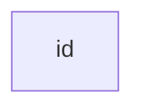
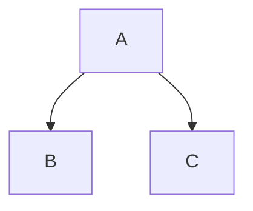
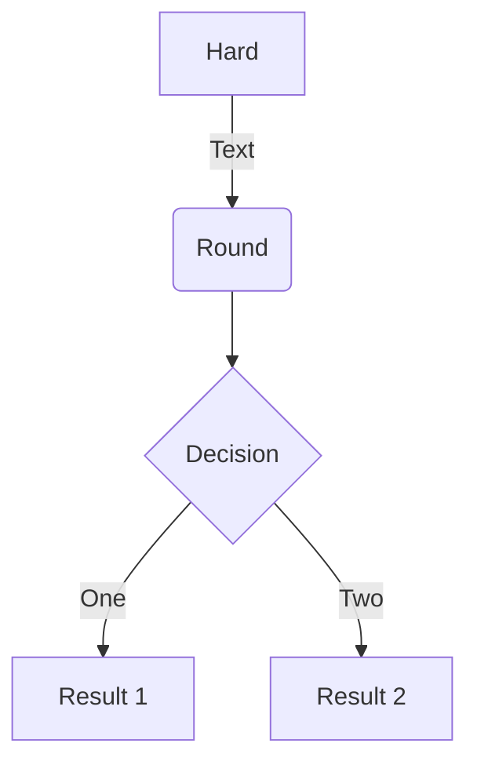

# Mermaid 🧜‍♀️
On Feb 14, 2022, Mermaid finally made its way to Github MD 👏
- [ ] [About Mermaid](http://mermaid-js.github.io/mermaid/#/)

## 01_Flowchart [Basic Syntax](https://mermaid-js.github.io/mermaid/#/./flowchart?id=flowcharts-basic-syntax)
All Flowcharts are composed of 
- nodes
- the geometric shapes
- and edges: the arrows or lines

**A node:** The id is what is displayed in the box.

