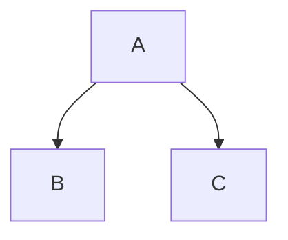
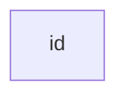
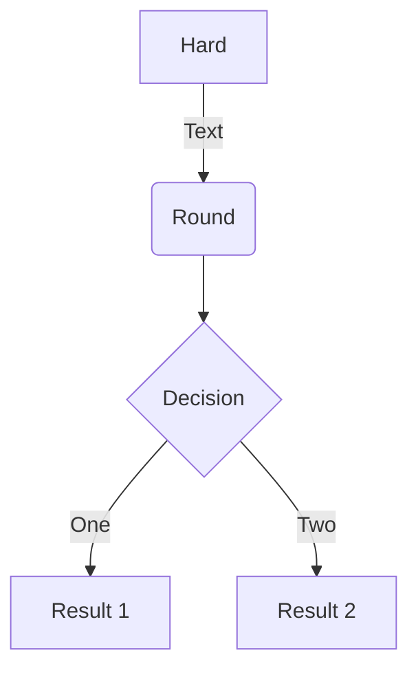

# Mermaid 🧜‍♀️
On Feb 14, 2022, Mermaid finally made its way to Github MD 👏
- [ ] [Include diagrams in your Markdown files with Mermaid](https://github.blog/2022-02-14-include-diagrams-markdown-files-mermaid/)

## 00_Examples

1. Simple Flow Chart

